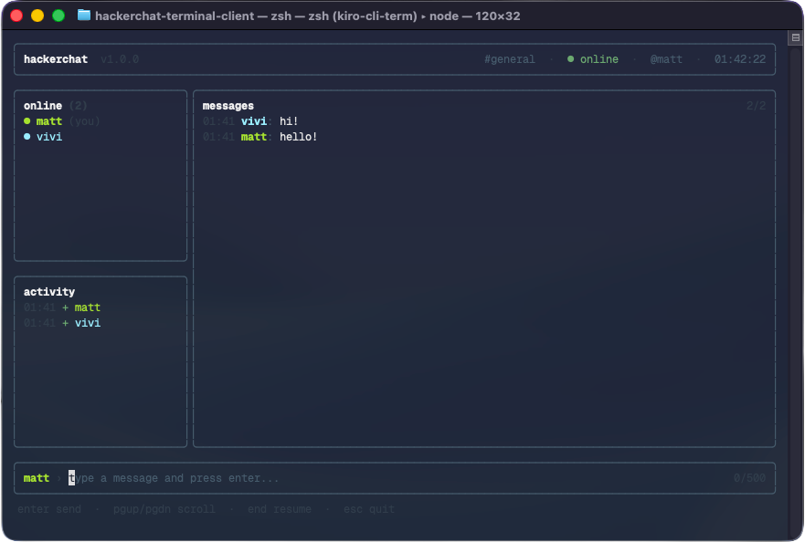

<h1 align="center">Hackerchat Terminal Client</h1>

<p align="center">
  A terminal chat client for Hackerchat Server, built with Node.js and TypeScript.
</p>

<p align="center">
  <a href="https://nodejs.org"></a>
  <a href="https://www.typescriptlang.org"></a>
  <a href="./LICENSE"></a>
</p>

<p align="center">
  
</p>

<p align="center">
  <a href="#overview">Overview</a> ·
  <a href="#features">Features</a> ·
  <a href="#requirements">Requirements</a> ·
  <a href="#usage">Usage</a> ·
  <a href="#development">Development</a> ·
  <a href="#related-projects">Related Projects</a>
</p>

---

## Overview

Hackerchat Terminal Client is a TUI that connects to a [Hackerchat Server](https://github.com/matheussartori/hackerchat-server) instance over WebSocket, so you can join a room and chat without leaving the shell.

The screen is split into a header with the room and connection status, a sidebar listing who is online alongside a join and leave log, the message pane, and the input bar at the bottom.

Since the server is client-agnostic, the client works against any deployment of it: a server running on your machine, one on a VPS, or one behind a reverse proxy on `wss://`.

## Features

- Room-based messaging in real time, directly in the terminal
- Interface built with [Ink](https://github.com/vadimdemedes/ink), React rendered to the terminal
- Sidebar with the room roster and a running log of who joined or left
- A colour picked per user and kept consistent for the whole session
- Scrollback with keyboard navigation, and a layout that reflows when the terminal is resized
- Runs in the alternate screen buffer, so your shell scrollback is left as it was on exit
- WebSocket handshake and framing written on top of Node's `http`/`https`, with no WebSocket library in the dependencies
- Written in TypeScript

## Requirements

Node.js `24` or newer, and a Hackerchat Server to connect to. See [hackerchat-server](https://github.com/matheussartori/hackerchat-server) for how to run one.

## Usage

Run it straight from npm, no installation needed:

```bash
npx @matheussartori/hackerchat-client --username alice --room general
```

That connects to `ws://localhost:9898`, the address a local server listens on by default. Point it somewhere else with `--hostUri`:

```bash
npx @matheussartori/hackerchat-client \
  --username alice \
  --room general \
  --hostUri wss://chat.example.com
```

| Flag | Required | Description |
| --- | --- | --- |
| `--username` | Yes | Display name shown to everyone in the room |
| `--room` | Yes | Room to join, created by the server if it does not exist |
| `--hostUri` | No | WebSocket URL of the server (`ws://` or `wss://`). Defaults to `ws://localhost:9898` |

### Keyboard shortcuts

| Key | Action |
| --- | --- |
| `Enter` | Send the current message |
| `Page Up` / `Page Down` | Scroll the history one screen at a time |
| `Ctrl+U` / `Ctrl+D` | Scroll the history one line at a time |
| `Home` / `End` | Jump to the oldest or the newest message |
| `Esc` or `Ctrl+C` | Leave the chat |

Messages are capped at 500 characters, and the counter next to the input turns red as you approach the limit.

### Installing globally

If you use it often, install it once and skip the `npx` prefix:

```bash
npm install -g @matheussartori/hackerchat-client
hackerchat --username alice --room general
```

## Development

This section is for contributing to the client or running it from source.

**1. Clone the repository**

```bash
git clone https://github.com/matheussartori/hackerchat-terminal-client.git
cd hackerchat-terminal-client
```

**2. Install dependencies**

```bash
npm install
```

**3. Start the client**

```bash
npm run dev -- --username alice --room general
```

The `--` separator is what tells npm to forward the flags to the script instead of consuming them itself. `tsx` runs the TypeScript sources directly, so there is no build step in the loop.

Watch mode is deliberately left out: `tsx watch` reads from stdin to support manual restarts on `Enter`, which collides with Ink's raw-mode keyboard handling and would restart the client on every keystroke.

**Other commands**

| Command | Description |
| --- | --- |
| `npm run build` | Compile TypeScript to `dist/` with `tsup` |
| `npm run typecheck` | Type-check without emitting |
| `npm run lint` | Lint `src` and `test` with ESLint |
| `npm run lint:fix` | Lint and apply the fixes it can |
| `npm run test:ci` | Run the test suite once |
| `npm run test:watch` | Run the tests in watch mode |
| `npm run test:coverage` | Run the tests and write a coverage report |
| `npm run check:pack` | Check that the npm tarball contains only what it should |

CI runs lint, typecheck, tests with coverage, the build, the packaging check and `npm audit` on Node 24 and 26.

## Related Projects

- [hackerchat-server](https://github.com/matheussartori/hackerchat-server) — The WebSocket server this client connects to
- [hackerchat-js-sdk](https://github.com/matheussartori/hackerchat-js-sdk) — JavaScript/TypeScript SDK with a framework-agnostic client and React bindings

## License

[MIT](./LICENSE) © [Matheus Sartori](https://github.com/matheussartori)
